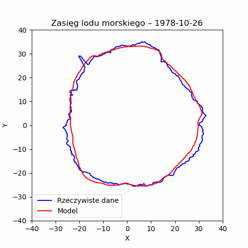

# 🧊 Spatio-temporal Modeling of Antarctic Sea Ice Extent (1978-2009)

> *Animation comparing the actual daily sea ice extent (blue) with the Fourier-based model predictions (red).*

## 📖 Project Overview
The main objective of this project was to analyze daily Antarctic sea ice extent data and develop a continuous mathematical model capable of simulating cyclical freeze-thaw patterns and long-term trends over a 30-year period.

## ⚙️ Mathematical Methodology

### 1. Extended Fourier Model
To capture the strong seasonality of sea ice, an extended Fourier series was implemented. The function models the latitude of the ice edge over time ($t$) for each specific longitude angle:

$$f(t)=\sum_{n=1}^{6}A_{n}\cos\left(\frac{2\pi n}{T}(t-\varphi_n)\right)+B+C \cdot t$$

* **6 Harmonics:** Six cosine waves with different frequencies ($n$) and phase shifts ($\varphi_n$) capture complex annual and sub-annual cycles.
* **Period ($T$):** Set to 365.25 days to accurately account for leap years.
* **Linear Trend ($C \cdot t$):** Captures long-term climatic tendencies and overall ice cover changes.
* **Optimization:** Parameters were fitted using the Non-Linear Least Squares method (`scipy.optimize.curve_fit` with up to 20,000 evaluations to prevent premature convergence).

### 2. 3D Binary Spatial Grid
For advanced spatial analysis, a 3D function was created:

$$f(Lat, Lon, t) \in \{0,1\}$$

It maps the geographical space into a binary grid where $1$ represents the presence of ice and $0$ indicates open water. This allowed for granular tracking of the ice cover across millions of data points.

## 📊 Dataset & Preprocessing
* **Source Data:** `daily_ice_edge.csv` (containing measurements from October 26, 1978, to 2009).
* **Data Cleaning:** Missing values (NaNs) were handled using time-based interpolation (`method="time"`) to ensure data continuity.
* **Transformations:** Geographical coordinates (latitude/longitude) were transformed into a polar coordinate system (radius and angle) and subsequently mapped to a 2D Cartesian plane (X, Y) for reliable visualization.

## 🚀 Technologies Used
* **Python** – Core programming language.
* **Pandas** – Data manipulation and time-series interpolation.
* **NumPy** – Matrix operations, trigonometry, and spatial grid generation.
* **SciPy** – Advanced mathematical modeling and parameter optimization.
* **Matplotlib & Pillow** – Data visualization, polar-to-Cartesian plotting, and GIF generation.
* **tqdm** – Processing progress tracking.

## 💡 Key Findings & Limitations
* **High Accuracy of Seasonality:** The 6-harmonic Fourier model proved to be highly effective at predicting the regular, cyclical expansion and retreat of the ice pack.
* **Local Anomalies:** The model occasionally diverges from real-world data in specific regions. This highlights the impact of complex, non-periodic environmental factors, such as macro-scale weather anomalies (e.g., El Niño / La Niña events) and shifting ocean currents.
* **Data Limitations:** Original data gaps slightly affected the optimization process in certain longitudinal sectors, proving that mathematical models are heavily dependent on raw data continuity.

## 💻 Installation & Usage
To run this project locally and generate your own models and animations:

1. Clone the repository: `git clone https://github.com/Szygo54/antarctic-ice-modeling`
2. Install dependencies: `pip install -r requirements.txt`
3. Run the notebook `antarctic_sea_ice_modeling.ipynb` to observe data transformations, model fitting, and visualization.
